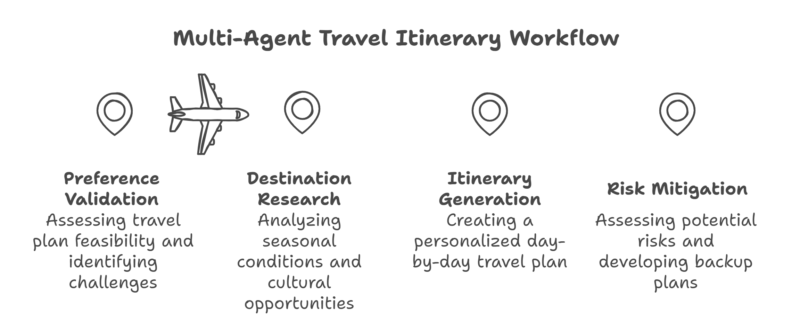
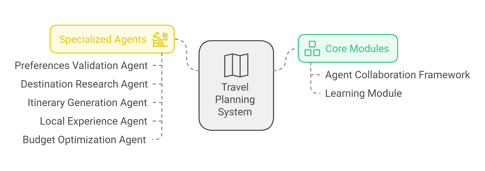

# 🌍 Travel Itinerary Generation System

<div align="center">
  
  
  <p>
    <a href="#core-modules">Core Modules</a> •
    <a href="#specialized-agents">Specialized Agents</a> •
    <a href="#code-workflow">Workflow</a> •
    <a href="#technology-stack">Tech Stack</a>
  </p>
</div>

## 🎯 Overview

This sophisticated travel planning system leverages multiple AI agents working collaboratively to create personalized travel experiences. Built with a modular architecture, the system combines specialized agents, a robust collaboration framework, and machine learning capabilities for continuous improvement.

## 🔧 Core Modules

<div align="center">
  
</div>

### 1. Agent Collaboration Framework 🤝

A sophisticated orchestration layer that manages inter-agent communications and workflow coordination.

<details>
<summary>Key Features</summary>

- Dynamic agent registry management
- Secure inter-agent communication protocols
- Configurable escalation thresholds
- Sequential travel planning pipeline
</details>

```javascript
// Example Configuration
export class AgentCollaborationFramework {
  // ... existing code ...
}
```

### 2. Learning Module 🧠

An intelligent system component that continuously evolves based on real-world feedback and outcomes.

<details>
<summary>Core Capabilities</summary>

- Travel outcome analysis & tracking
- Experience comparison analytics
- AI-powered recommendation engine
- Dynamic knowledge base management
</details>

## 🤖 Specialized Agents

<table>
  <tr>
    <th>Agent</th>
    <th>Responsibility</th>
  </tr>
  <tr>
    <td>🔍 PreferencesValidationAgent</td>
    <td>
      - Validates travel preferences<br/>
      - Assesses feasibility<br/>
      - Evaluates budget constraints
    </td>
  </tr>
  <tr>
    <td>📚 DestinationResearchAgent</td>
    <td>
      - Analyzes seasonal conditions<br/>
      - Explores cultural opportunities<br/>
      - Evaluates destination risks
    </td>
  </tr>
  <tr>
    <td>📅 ItineraryGenerationAgent</td>
    <td>
      - Creates detailed itineraries<br/>
      - Optimizes activity scheduling<br/>
      - Balances experiences
    </td>
  </tr>
  <tr>
    <td>🌟 LocalExperienceAgent</td>
    <td>
      - Provides local insights<br/>
      - Recommends unique experiences<br/>
      - Suggests hidden gems
    </td>
  </tr>
  <tr>
    <td>💰 BudgetOptimizationAgent</td>
    <td>
      - Optimizes travel costs<br/>
      - Balances budget/experience<br/>
      - Generates cost estimates
    </td>
  </tr>
</table>

## ⚙️ Code Workflow

<div align="center">
  
</div>

1. **🚀 Initialize**

   - Learning module setup
   - Agent registration
   - Protocol configuration

2. **📝 User Input**

   - Travel preferences collection
   - Constraint definition
   - Experience priorities

3. **🤝 Agent Collaboration**

   - Coordinated validation
   - Research synthesis
   - Itinerary optimization

4. **📊 Learning Module**

   - Outcome analysis
   - Strategy refinement
   - Performance optimization

5. **✨ Final Output**
   - Detailed itinerary
   - Cost breakdown
   - Local recommendations

## 🛠️ Technology Stack

<div align="center">

[](https://www.typescriptlang.org/)
[](https://openai.com/)
[](https://nodejs.org/)

</div>

## 🚀 Recommended Enhancements

- [ ] Implement Redis caching layer
- [ ] Add comprehensive error handling
- [ ] Create MongoDB storage for insights
- [ ] Develop TensorFlow feedback loop
- [ ] Integrate real-time travel APIs

## 📝 Contributing

Contributions are welcome! Please read our [Contributing Guide](CONTRIBUTING.md) for details on our code of conduct and the process for submitting pull requests.

## 📄 License

This project is licensed under the MIT License - see the [LICENSE](LICENSE) file for details.

---

<div align="center">
  <p>Made with ❤️ for travelers worldwide</p>
</div>
