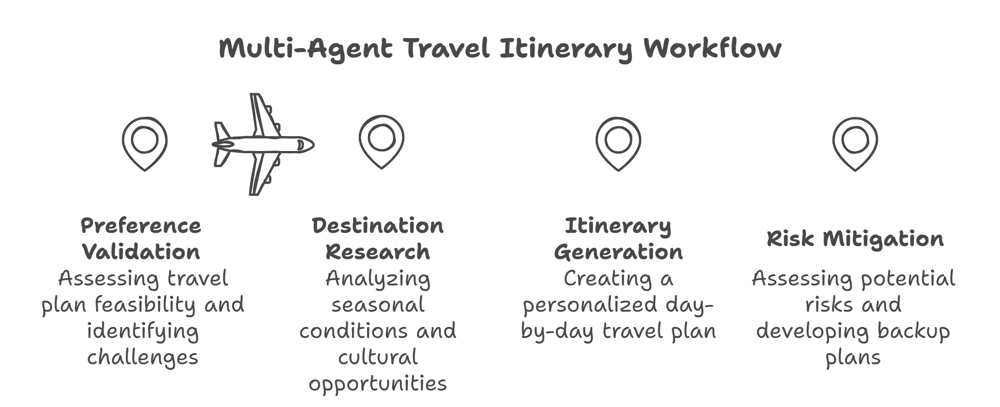
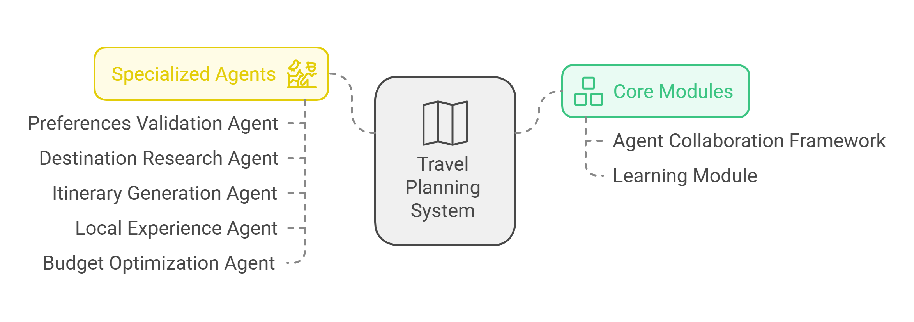

# 🌍 Travel Itinerary Generation System

<div align="center">

[](https://github.com/kingshuknandy2016/multi-agent-travel-iternary-generation-system/actions/workflows/ci.yml)

<sub>GitHub Actions: Node 20 · <code>npm ci</code> · <code>npm run build</code> (<code>tsc</code>) — see <a href=".github/workflows/ci.yml"><code>.github/workflows/ci.yml</code></a></sub>



<p>
  <a href="#quick-start">Quick Start</a> •
  <a href="#core-modules">Core Modules</a> •
  <a href="#specialized-agents">Specialized Agents</a> •
  <a href="#code-workflow">Workflow</a> •
  <a href="#sample-output">Sample Output</a> •
  <a href="#technology-stack">Tech Stack</a>
</p>

</div>

## Quick Start

```bash
git clone https://github.com/kingshuknandy2016/multi-agent-travel-iternary-generation-system
cd multi-agent-travel-iternary-generation-system
cp .env.example .env   # add your OPENAI_API_KEY
npm install
npm run start
```

## 🎯 Overview

This sophisticated travel planning system leverages multiple AI agents working collaboratively to create personalized travel experiences. Built with a modular architecture, the system combines specialized agents, a robust collaboration framework, and machine learning capabilities for continuous improvement.

## 🔧 Core Modules

<div align="center">
  
</div>

### 1. Agent Collaboration Framework 🤝

A sophisticated orchestration layer that manages inter-agent communications and workflow coordination.

<details>
<summary>Key Features</summary>

- Dynamic agent registry management
- Secure inter-agent communication protocols
- Configurable escalation thresholds
- Sequential travel planning pipeline
</details>

```typescript
// Excerpt from src/main.ts — register agents with the collaboration framework
const collaborationFramework = new AgentCollaborationFramework();
const apiKey = process.env.OPENAI_API_KEY || "";

collaborationFramework.registerAgent("validation", new PreferencesValidationAgent(apiKey));
collaborationFramework.registerAgent("research", new DestinationResearchAgent(apiKey));
collaborationFramework.registerAgent("generation", new ItineraryGenerationAgent(apiKey));
collaborationFramework.registerAgent("riskMitigation", new RiskMitigationAgent(apiKey));
collaborationFramework.registerAgent("budgetOptimization", new BudgetOptimizationAgent(apiKey));
collaborationFramework.registerAgent("localExperience", new LocalExperienceAgent(apiKey));
```

### 2. Learning Module 🧠

An intelligent system component that continuously evolves based on real-world feedback and outcomes.

<details>
<summary>Core Capabilities</summary>

- Travel outcome analysis & tracking
- Experience comparison analytics
- AI-powered recommendation engine
- Dynamic knowledge base management
</details>

## 🤖 Specialized Agents

<table>
  <tr>
    <th>Agent</th>
    <th>Responsibility</th>
  </tr>
  <tr>
    <td>🔍 PreferencesValidationAgent</td>
    <td>
      - Validates travel preferences<br/>
      - Assesses feasibility<br/>
      - Evaluates budget constraints
    </td>
  </tr>
  <tr>
    <td>📚 DestinationResearchAgent</td>
    <td>
      - Analyzes seasonal conditions<br/>
      - Explores cultural opportunities<br/>
      - Evaluates destination risks
    </td>
  </tr>
  <tr>
    <td>📅 ItineraryGenerationAgent</td>
    <td>
      - Creates detailed itineraries<br/>
      - Optimizes activity scheduling<br/>
      - Balances experiences
    </td>
  </tr>
  <tr>
    <td>🌟 LocalExperienceAgent</td>
    <td>
      - Provides local insights<br/>
      - Recommends unique experiences<br/>
      - Suggests hidden gems
    </td>
  </tr>
  <tr>
    <td>💰 BudgetOptimizationAgent</td>
    <td>
      - Optimizes travel costs<br/>
      - Balances budget/experience<br/>
      - Generates cost estimates
    </td>
  </tr>
</table>

## ⚙️ Code Workflow

<div align="center">
  
</div>

1. **🚀 Initialize**

   - Learning module setup
   - Agent registration
   - Protocol configuration

2. **📝 User Input**

   - Travel preferences collection
   - Constraint definition
   - Experience priorities

3. **🤝 Agent Collaboration**

   - Coordinated validation
   - Research synthesis
   - Itinerary optimization

4. **📊 Learning Module**

   - Outcome analysis
   - Strategy refinement
   - Performance optimization

5. **✨ Final Output**
   - Detailed itinerary
   - Cost breakdown
   - Local recommendations

## Sample Output

Runs write a collaboration payload to `output/travel-plans/collaboration-result.json`. Shape: top-level `finalOutput` (merged trip plan) and `stageResults` (per-agent outputs in pipeline order).

**Input:** "5 days in Kyoto, Japan · Budget $1500 · Focus: culture + food"

**Output excerpt** (abbreviated; full files include every day and complete lists):

```json
{
  "finalOutput": {
    "destination": "Kyoto, Japan",
    "travelDates": { "start": "2025-06-01", "end": "2025-06-05" },
    "travelerCount": 2,
    "budget": 1500,
    "interests": ["culture", "food"],
    "travelStyle": "cultural",
    "validationResult": {
      "feasibilityScore": 88,
      "potentialChallenges": ["Peak season crowds at major temples"],
      "recommendationFlags": ["Visit Fushimi Inari early morning to avoid crowds"]
    },
    "researchResult": {
      "seasonalConditions": "Early June: warm, occasional rain; hydrangea season.",
      "culturalOpportunities": [
        "Temples and shrines in Higashiyama",
        "Kaiseki and Nishiki Market street food"
      ],
      "hiddenGemLocations": [
        "Otagi Nenbutsu-ji",
        "Philosopher's Path side alleys"
      ],
      "riskAssessment": "Very safe; stay hydrated in summer heat.",
      "budgetStrategies": ["IC card + local buses", "Set menus at lunch"],
      "uniqueExperiences": ["Tea ceremony", "Evening walk in Gion"]
    },
    "generationResult": {
      "destination": "Kyoto, Japan",
      "totalDays": 5,
      "dailyActivities": [
        {
          "day": 1,
          "activities": [
            "Fushimi Inari Shrine (early)",
            "Nishiki Market lunch",
            "Gion evening stroll"
          ],
          "estimatedCost": 120
        },
        {
          "day": 2,
          "activities": [
            "Arashiyama bamboo grove",
            "Tenryu-ji gardens",
            "Cooking class (local recommendation)"
          ],
          "estimatedCost": 185
        }
      ]
    },
    "riskMitigationResult": {
      "riskProbabilities": {
        "earthquakes": 0.35,
        "typhoons": 0.15,
        "crime": 0.05
      },
      "mitigationStrategies": [
        "Travel insurance covering natural disasters"
      ],
      "backupPlans": [
        "Indoor temple/museum alternatives if heavy rain"
      ]
    }
  },
  "stageResults": [
    {
      "feasibilityScore": 88,
      "potentialChallenges": ["Peak season crowds at major temples"],
      "recommendationFlags": ["Visit Fushimi Inari early morning to avoid crowds"]
    },
    {
      "seasonalConditions": "Early June: warm, occasional rain; hydrangea season.",
      "culturalOpportunities": [
        "Temples and shrines in Higashiyama",
        "Kaiseki and Nishiki Market street food"
      ],
      "hiddenGemLocations": [
        "Otagi Nenbutsu-ji",
        "Philosopher's Path side alleys"
      ],
      "riskAssessment": "Very safe; stay hydrated in summer heat.",
      "budgetStrategies": ["IC card + local buses", "Set menus at lunch"],
      "uniqueExperiences": ["Tea ceremony", "Evening walk in Gion"]
    },
    {
      "destination": "Kyoto, Japan",
      "totalDays": 5,
      "dailyActivities": [
        {
          "day": 1,
          "activities": [
            "Fushimi Inari Shrine (early)",
            "Nishiki Market lunch",
            "Gion evening stroll"
          ],
          "estimatedCost": 120
        },
        {
          "day": 2,
          "activities": [
            "Arashiyama bamboo grove",
            "Tenryu-ji gardens",
            "Cooking class (local recommendation)"
          ],
          "estimatedCost": 185
        }
      ]
    },
    {
      "riskProbabilities": {
        "earthquakes": 0.35,
        "typhoons": 0.15,
        "crime": 0.05
      },
      "mitigationStrategies": [
        "Travel insurance covering natural disasters"
      ],
      "backupPlans": [
        "Indoor temple/museum alternatives if heavy rain"
      ]
    }
  ]
}
```

## 🛠️ Technology Stack

<div align="center">

[](https://www.typescriptlang.org/)
[](https://openai.com/)
[](https://nodejs.org/)

</div>

## 🗺️ Roadmap

Directional enhancements under consideration—not a backlog of unfinished core features:

- **Caching** — Redis (or similar) for repeated destination research and LLM response memoization
- **Resilience** — Broader error handling, retries, and degraded modes when upstream APIs fail
- **Persistence** — MongoDB or another store for learning-module insights and historical plans
- **Feedback loop** — TensorFlow or classical models on top of recorded travel outcomes
- **Live data** — Real-time travel APIs (flights, weather, events) layered onto generated itineraries

## 📝 Contributing

Contributions are welcome! Please read our [Contributing Guide](CONTRIBUTING.md) for details on our code of conduct and the process for submitting pull requests.

## 📄 License

This project is licensed under the MIT License - see the [LICENSE](LICENSE) file for details.

---

<div align="center">
  <p>Made with ❤️ for travelers worldwide</p>
</div>
